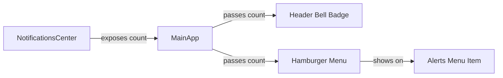

# Navigation Restructure Plan

## Overview
Restructure the BusTracker mobile app navigation from a bottom navigation bar to a top hamburger menu with integrated notification count badge.

## Current State Analysis

### Current Navigation Structure
- **Location**: Bottom navigation bar (fixed at bottom)
- **Menu Items**: 
  - Home (MapPin icon)
  - Map (Bus icon)
  - Alerts/Notifications (Bell icon)
  - Admin (Shield icon - conditional)
  - Profile (Settings icon)
- **Header**: Contains BusTracker logo, coins badge, admin access badge, role badge, and notification bell button
- **File**: [`src/MainApp.tsx`](src/MainApp.tsx:1145-1193)

### Current Notification System
- **Component**: [`NotificationsCenter`](src/components/NotificationsCenter.tsx)
- **Features**:
  - Driver broadcasts (expire after 24 hours)
  - Bus arrival alerts (proximity-based)
  - Live driver updates
  - Polling interval: 15 seconds
- **State**: Notifications stored in local state, no count exposed to parent

## Proposed Changes

### 1. New Top Navigation Layout

```
┌─────────────────────────────────────────────┐
│ [☰] BusTracker Logo    [🔔 3] [Coins] [Role]│
└─────────────────────────────────────────────┘
```

**Components**:
- **Hamburger Menu Button** (top-left, next to logo)
- **BusTracker Logo** (remains in header)
- **Notification Bell with Badge** (shows unread count)
- **Coins Badge** (existing)
- **Role Badge** (existing)

### 2. Hamburger Menu Structure

**Menu Items** (in order):
1. 🏠 Home
2. 🗺️ Map
3. 🔔 Alerts (with notification count badge)
4. 👤 Profile
5. 🛡️ Admin (conditional - only if `hasAdminPanelAccess`)

**Behavior**:
- Opens from left side
- Overlay/drawer style
- Click outside to close
- Highlight active menu item
- Show notification count on Alerts menu item

### 3. Notification Count System

**Data Flow**:


**Implementation**:
- Add `onNotificationCountChange` callback prop to [`NotificationsCenter`](src/components/NotificationsCenter.tsx)
- Calculate count from `liveNotifications` array (non-expired notifications)
- Lift notification count state to [`MainApp`](src/MainApp.tsx)
- Pass count to header and hamburger menu components

### 4. Component Architecture

#### New Components to Create:
1. **`HamburgerMenu.tsx`**
   - Props: `activeTab`, `onTabChange`, `notificationCount`, `hasAdminAccess`
   - Uses Sheet component from shadcn/ui
   - Renders menu items with icons and labels
   - Shows badge on Alerts item when count > 0

#### Components to Modify:
1. **[`MainApp.tsx`](src/MainApp.tsx)**
   - Add `notificationCount` state
   - Add hamburger menu to header
   - Update notification bell badge to show count
   - Remove bottom navigation bar (lines 1145-1193)
   - Add callback to receive notification count from NotificationsCenter

2. **[`NotificationsCenter.tsx`](src/components/NotificationsCenter.tsx)**
   - Add `onNotificationCountChange` prop
   - Call callback when `liveNotifications` changes
   - Export notification count via useEffect

## Implementation Steps

### Step 1: Create Notification Count Tracking
- Modify [`NotificationsCenter`](src/components/NotificationsCenter.tsx) to expose notification count
- Add `onNotificationCountChange?: (count: number) => void` prop
- Use `useEffect` to call callback when `liveNotifications` changes

### Step 2: Create HamburgerMenu Component
- Create new file: `src/components/HamburgerMenu.tsx`
- Use [`Sheet`](src/components/ui/sheet.tsx) component for drawer
- Import icons: Home, Map, Bell, User, Shield from lucide-react
- Add notification badge to Alerts menu item
- Style active menu item differently

### Step 3: Update MainApp Header
- Add `notificationCount` state in [`MainApp`](src/MainApp.tsx)
- Add HamburgerMenu component next to logo
- Update Bell button to show badge with count
- Position hamburger button at top-left

### Step 4: Remove Bottom Navigation
- Delete bottom navigation code (lines 1145-1193 in [`MainApp.tsx`](src/MainApp.tsx))
- Remove `pb-32 sm:pb-6` padding from main content area
- Adjust layout for full-height content

### Step 5: Update NotificationsCenter Integration
- Pass `onNotificationCountChange` callback to [`NotificationsCenter`](src/components/NotificationsCenter.tsx)
- Ensure count updates in real-time as notifications are loaded/expired

### Step 6: Styling and Polish
- Ensure hamburger menu has smooth animations
- Add proper z-index layering
- Test on mobile viewport sizes
- Ensure accessibility (keyboard navigation, ARIA labels)

## Technical Considerations

### State Management
```typescript
// In MainApp.tsx
const [notificationCount, setNotificationCount] = useState(0);

// Pass to NotificationsCenter
<NotificationsCenter
  // ... existing props
  onNotificationCountChange={setNotificationCount}
/>
```

### Notification Count Calculation
```typescript
// In NotificationsCenter.tsx
useEffect(() => {
  const count = liveNotifications.length;
  onNotificationCountChange?.(count);
}, [liveNotifications, onNotificationCountChange]);
```

### Badge Display Logic
```typescript
// Show badge only when count > 0
{notificationCount > 0 && (
  <Badge className="absolute -top-1 -right-1">
    {notificationCount}
  </Badge>
)}
```

## UI/UX Improvements

### Hamburger Menu Design
- **Width**: 280px (mobile), 320px (tablet+)
- **Animation**: Slide in from left (200ms ease-out)
- **Backdrop**: Semi-transparent overlay
- **Menu Items**: 
  - Height: 48px
  - Padding: 12px 16px
  - Active state: Primary background color
  - Hover state: Subtle background change

### Notification Badge
- **Position**: Top-right of bell icon
- **Size**: 18px diameter (or auto-width for 2+ digits)
- **Color**: Red/destructive variant
- **Text**: White, bold, 10-11px font size
- **Max Display**: Show "9+" for counts >= 10

### Responsive Behavior
- **Mobile (<640px)**: Full-width menu overlay
- **Tablet (640px-1024px)**: 320px menu width
- **Desktop (>1024px)**: Consider keeping menu visible or use same drawer

## Accessibility Requirements

1. **Keyboard Navigation**
   - Tab through menu items
   - Enter/Space to activate
   - Escape to close menu

2. **Screen Readers**
   - ARIA label for hamburger button: "Open navigation menu"
   - ARIA label for notification badge: "3 unread notifications"
   - ARIA current for active menu item

3. **Focus Management**
   - Focus hamburger button when menu closes
   - Focus first menu item when menu opens
   - Trap focus within menu when open

## Testing Checklist

- [ ] Hamburger menu opens and closes smoothly
- [ ] All menu items navigate correctly
- [ ] Active menu item is highlighted
- [ ] Notification count updates in real-time
- [ ] Badge appears/disappears based on count
- [ ] Badge shows correct count
- [ ] Bottom navigation is completely removed
- [ ] Content area uses full height
- [ ] Works on mobile viewport (320px-640px)
- [ ] Works on tablet viewport (640px-1024px)
- [ ] Keyboard navigation works
- [ ] Screen reader announces correctly
- [ ] No layout shifts or visual glitches

## Files to Modify

1. **Create**: `src/components/HamburgerMenu.tsx`
2. **Modify**: [`src/MainApp.tsx`](src/MainApp.tsx)
   - Add hamburger menu to header
   - Add notification count state
   - Update bell badge
   - Remove bottom navigation
3. **Modify**: [`src/components/NotificationsCenter.tsx`](src/components/NotificationsCenter.tsx)
   - Add notification count callback prop
   - Expose count via useEffect

## Dependencies

All required dependencies are already installed:
- `lucide-react` - Icons
- `@radix-ui/react-dialog` - Sheet/Drawer component (via shadcn/ui)
- Existing UI components from [`src/components/ui/`](src/components/ui/)

## Rollback Plan

If issues arise:
1. Keep bottom navigation code in a separate branch
2. Feature flag to toggle between old/new navigation
3. Revert notification count changes if performance issues occur

## Success Metrics

- Navigation is more accessible (top-left is easier to reach)
- Notification count is visible at all times
- Cleaner UI with more content space
- Maintains all existing functionality
- No performance degradation
